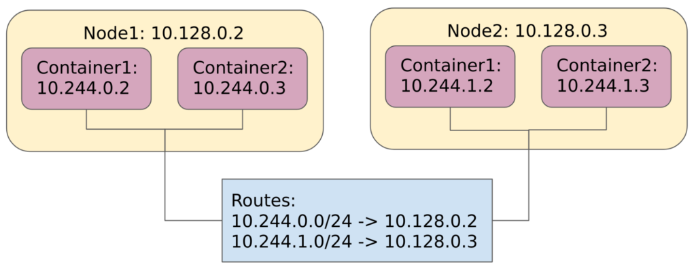
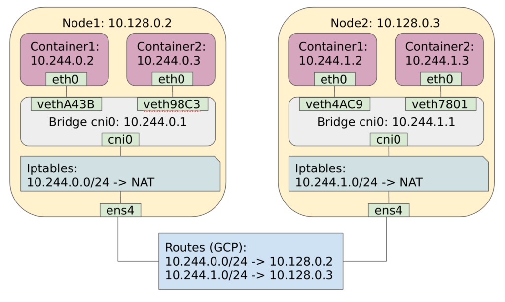

# CNI Networking (Demo)

1. Kubernetes network model 

    

1. Create master VM
    ```
    gcloud compute instances create k8s-master \
        --zone us-central1-b \
        --image-family ubuntu-1604-lts \
        --image-project ubuntu-os-cloud \
        --can-ip-forward
    ```

1. Create worker VM
    ```
    gcloud compute instances create k8s-worker \
        --zone us-central1-b \
        --image-family ubuntu-1604-lts \
        --image-project ubuntu-os-cloud \
        --can-ip-forward
    ```

1. Install some prerequisite packages 
    ```
    sudo apt-get update
    sudo apt-get install -y docker.io apt-transport-https curl jq nmap iproute2
    ```

1. Install kubeadm, kubelet, and kubectl
    ```
    $ sudo su
    $ curl -s https://packages.cloud.google.com/apt/doc/apt-key.gpg | apt-key add -
    $ cat > /etc/apt/sources.list.d/kubernetes.list <<EOF
    deb http://apt.kubernetes.io/ kubernetes-xenial main
    EOF
    $ apt-get install -y kubeadm kubelet kubectl
    ```

1. Start the cluster 
    ```
    $ sudo kubeadm init --pod-network-cidr=10.244.0.0/16
    ```

1. Join the worker (copy the command from the previous command output)

1. Init kubectl
    ```
    mkdir -p $HOME/.kube
    sudo cp -i /etc/kubernetes/admin.conf $HOME/.kube/config
    sudo chown $(id -u):$(id -g) $HOME/.kube/config
    ``` 

1. Get pod subnets
    ```
    $ kubectl describe node k8s-master | grep PodCIDR
    PodCIDR:                     10.244.0.0/24

    $ kubectl describe node k8s-worker | grep PodCIDR
    PodCIDR:                     10.244.1.0/24
    ```

1. Create `/etc/cni/net.d/10-bash-cni-plugin.conf`
    master:
    ```
    {
            "cniVersion": "0.3.1",
            "name": "mynet",
            "type": "bash-cni",
            "network": "10.244.0.0/16",
            "subnet": "10.244.0.0/24"
    }
    ```
    worker:
    ```
    {
            "cniVersion": "0.3.1",
            "name": "mynet",
            "type": "bash-cni",
            "network": "10.244.0.0/16",
            "subnet": "10.244.1.0/24"
    }
    ```

1. Create the bridge
    master:
    ```
    $ sudo brctl addbr cni0
    $ sudo ip link set cni0 up
    $ sudo ip addr add 10.244.0.1/24 dev cni0
    ```
    worker:
    ```
    $ sudo brctl addbr cni0
    $ sudo ip link set cni0 up
    $ sudo ip addr add 10.244.1.1/24 dev cni0
    ```

1. Check generated routes
    master:
    ```
    $ ip route | grep cni0
    10.244.0.0/24 dev cni0  proto kernel  scope link  src 10.244.0.1
    ```
    worker:
    ```
    $ ip route | grep cni0
    10.244.1.0/24 dev cni0  proto kernel  scope link  src 10.244.1.1
    ```

1. Create `/opt/cni/bin/bash-cni`
    ```
    #!/bin/bash -e

    if [[ ${DEBUG} -gt 0 ]]; then set -x; fi

    exec 3>&1 # make stdout available as fd 3 for the result
    exec &>> /var/log/bash-cni-plugin.log

    IP_STORE=/tmp/reserved_ips # all reserved ips will be stored there

    echo "CNI command: $CNI_COMMAND" 

    stdin=`cat /dev/stdin`
    echo "stdin: $stdin"

    allocate_ip(){
            for ip in "${all_ips[@]}"
            do
                    reserved=false
                    for reserved_ip in "${reserved_ips[@]}"
                    do
                            if [ "$ip" = "$reserved_ip" ]; then
                                    reserved=true
                                    break
                            fi
                    done
                    if [ "$reserved" = false ] ; then
                            echo "$ip" >> $IP_STORE
                            echo "$ip"
                            return
                    fi
            done
    }

    case $CNI_COMMAND in
    ADD)
            network=$(echo "$stdin" | jq -r ".network")
            subnet=$(echo "$stdin" | jq -r ".subnet")
            subnet_mask_size=$(echo $subnet | awk -F  "/" '{print $2}')

            all_ips=$(nmap -sL $subnet | grep "Nmap scan report" | awk '{print $NF}')
            all_ips=(${all_ips[@]})
            skip_ip=${all_ips[0]}
            gw_ip=${all_ips[1]}
            reserved_ips=$(cat $IP_STORE 2> /dev/null || printf "$skip_ip\n$gw_ip\n") # reserving 10.244.0.0 and 10.244.0.1 
            reserved_ips=(${reserved_ips[@]})
            printf '%s\n' "${reserved_ips[@]}" > $IP_STORE
            container_ip=$(allocate_ip)

            mkdir -p /var/run/netns/
            ln -sfT $CNI_NETNS /var/run/netns/$CNI_CONTAINERID

            rand=$(tr -dc 'A-F0-9' < /dev/urandom | head -c4)
            host_if_name="veth$rand"
            ip link add $CNI_IFNAME type veth peer name $host_if_name 

            ip link set $host_if_name up 
            ip link set $host_if_name master cni0 

            ip link set $CNI_IFNAME netns $CNI_CONTAINERID
            ip netns exec $CNI_CONTAINERID ip link set $CNI_IFNAME up
            ip netns exec $CNI_CONTAINERID ip addr add $container_ip/$subnet_mask_size dev $CNI_IFNAME
            ip netns exec $CNI_CONTAINERID ip route add default via $gw_ip dev $CNI_IFNAME 

            mac=$(ip netns exec $CNI_CONTAINERID ip link show eth0 | awk '/ether/ {print $2}')
    echo "{
      \"cniVersion\": \"0.3.1\",
      \"interfaces\": [                                            
          {
              \"name\": \"eth0\",
              \"mac\": \"$mac\",                            
              \"sandbox\": \"$CNI_NETNS\" 
          }
      ],
      \"ips\": [
          {
              \"version\": \"4\",
              \"address\": \"$container_ip/$subnet_mask_size\",
              \"gateway\": \"$gw_ip\",          
              \"interface\": 0 
          }
      ]
    }" >&3

    ;;

    DEL)
            ip=$(ip netns exec $CNI_CONTAINERID ip addr show eth0 | awk '/inet / {print $2}' | sed  s%/.*%% || echo "")
            if [ ! -z "$ip" ]
            then
                    sed -i "/$ip/d" $IP_STORE
            fi
    ;;

    GET)
            echo "GET not supported"
            exit 1
    ;;

    VERSION)
    echo '{
      "cniVersion": "0.3.1", 
      "supportedVersions": [ "0.3.0", "0.3.1", "0.4.0" ] 
    }' >&3
    ;;

    *)
      echo "Unknown cni commandn: $CNI_COMMAND" 
      exit 1
    ;;

    esac

    ```

1. Check node status
    ```
    $ kubectl get node
    ``` 

1. Untaint the master node
    ```
    $ kubectl taint nodes k8s-master node-role.kubernetes.io/master-
    ```

1. Add sample deployment
    ```
    $ kubectl apply -f https://raw.githubusercontent.com/s-matyukevich/bash-cni-plugin/master/01_gcp/test-deployment.yml
    ``` 

1. Get pod IPs
    ```
    $ k$ kubectl describe pod | grep IP
    IP:                 10.244.0.4
    IP:                 10.244.1.3
    IP:                 10.244.0.6
    IP:                 10.244.1.2
    ```

1. Get inside one of the pods
    ```
    $ kubectl exec -it bash-master bash
    ``` 

1. Verify network conectivity
    ```
    $ ping 10.128.0.2 # can ping own host 
    PING 10.128.0.2 (10.128.0.2) 56(84) bytes of data.
    64 bytes from 10.128.0.2: icmp_seq=1 ttl=64 time=0.110 ms

    $ ping 10.128.0.3 # can’t ping different host 
    PING 10.128.0.3 (10.128.0.3) 56(84) bytes of data.

    $ ping 10.244.0.6 # can’t ping a container on the same host
    PING 10.244.0.6 (10.244.0.6) 56(84) bytes of data.

    $ ping 10.244.1.3 # can’t ping a container on a different host
    PING 10.244.1.3 (10.244.1.3) 56(84) bytes of data.

    $ ping 108.177.121.113 # can’t ping any external address
    PING 108.177.121.113 (108.177.121.113) 56(84) bytes of data.
    ``` 

1. Examine forwarding rules 
    ```
    $ sudo iptables -S FORWARD
    -P FORWARD DROP
    -A FORWARD -m comment --comment "kubernetes forwarding rules" -j KUBE-FORWARD
    -A FORWARD -j DOCKER-ISOLATION
    -A FORWARD -o docker0 -j DOCKER
    -A FORWARD -o docker0 -m conntrack --ctstate RELATED,ESTABLISHED -j ACCEPT
    -A FORWARD -i docker0 ! -o docker0 -j ACCEPT
    -A FORWARD -i docker0 -o docker0 -j ACCEPT
    ```

1. Allow forwarding
    ```
    $ sudo iptables -t filter -A FORWARD -s 10.244.0.0/16 -j ACCEPT
    $ sudo iptables -t filter -A FORWARD -d 10.244.0.0/16 -j ACCEPT
    ``` 

1. Add masquerade rules
    master:
    ```
    $ sudo iptables -t nat -A POSTROUTING -s 10.244.0.0/24 ! -o cni0 -j MASQUERADE
    ``` 
    worker:
    ```
    $ sudo iptables -t nat -A POSTROUTING -s 10.244.1.0/24 ! -o cni0 -j MASQUERADE
    ```

1. Configure GCP routes
    ```
    $ gcloud compute routes create k8s-master --destination-range 10.244.0.0/24 --network k8s --next-hop-address 10.128.0.2

    $ gcloud compute routes create k8s-worker --destination-range 10.244.1.0/24 --network k8s --next-hop-address 10.128.0.3
    ```

1. Retest network conectivity.

1. Resulting solution

    

1. Check [Kubernetes Networking: How to Write Your Own CNI Plug-in with Bash](https://www.altoros.com/blog/kubernetes-networking-writing-your-own-simple-cni-plug-in-with-bash/) for more details.
