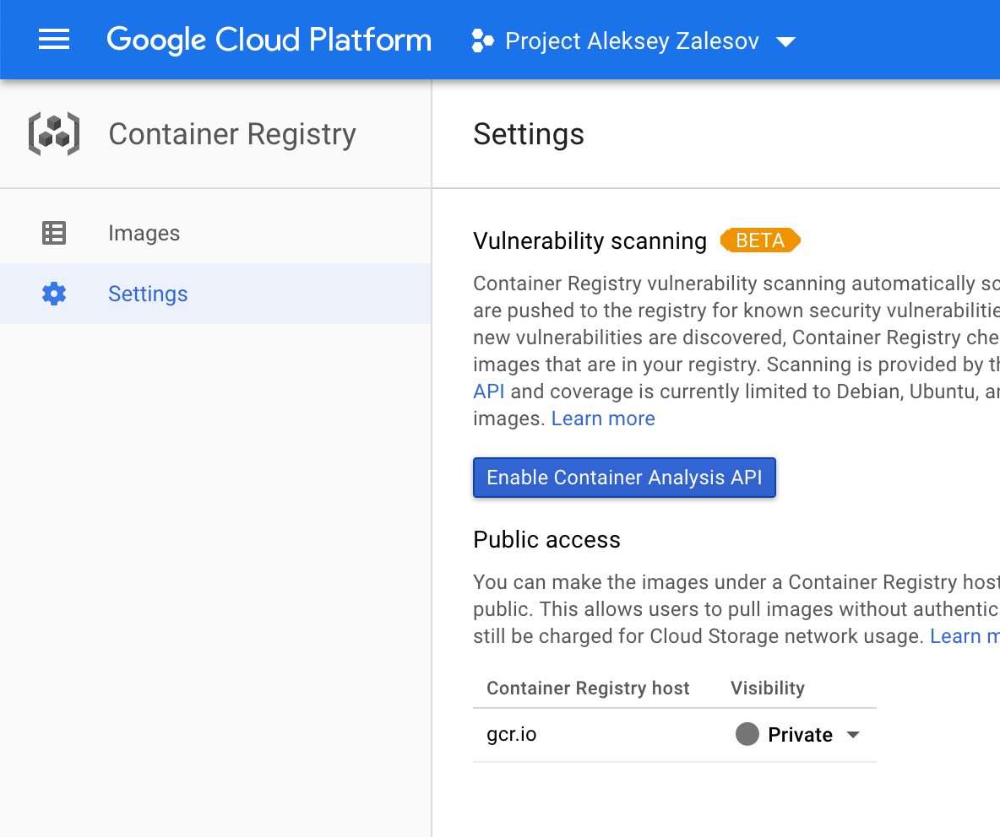

# Securing Container Images

## Module Objectives

1. Enable GCR Vulnerability Scanning
1. View and filter vulnerability occurrences
1. Redeploy the cluster with Binary Authorization enabled
1. Configure and test custom binary authorization policy"

## Enable GCR Vulnerability Scanning

Google container registry may scan images for known vulnerabilities. It will notify you by adding `Vulnerabilities` columen in the image build list. You may extend the support further by enabling Cloud Pub/Sub queue notifications to trigger automated response and Binary Authorisation to prevent insecure images from running on top of Kubernetes cluster.

1. From Google Web Console go to Container Registry -> Settings

1. In the Settings click `Enable Container Analysis API`

    

    Container registry scanning will be enabled automatically.

1. Now each image screen will show the vulnerabilities per build.

    

1. Click on the vulnerabilities column to show the list of vulnerabilities. Each has severity column which tells how dangerous is the bug, package column - the component of the image that has the bug and link to CVE describing it.

Scans currently work for Alpine, Ubuntu and Debian systems.

## View and filter vulnerability occurrences

To view summary of vulnerabilities for the application image one may use `gcloud` command.

```shell
$ gcloud beta container images list-tags --show-occurrences \
  gcr.io/project-aleksey-zalesov/sample-k8s-app \
  --occurrence-filter='kind="PACKAGE" AND has_prefix(resource_url, "gcr.io/project-aleksey-zalesov/sample-k8s-app")'
DIGEST        TAGS   TIMESTAMP            VULNERABILITIES
1dd9b5827cc3  1.0.2  2018-11-30T10:36:17  CRITICAL=5,HIGH=35,LOW=21,MEDIUM=184
fbccfc8b25fe  1.0.0  2018-11-26T12:29:40  CRITICAL=5,HIGH=35,LOW=21,MEDIUM=184
```

This example shows vulnerability summary for the image `sample-k8s-app` in the project `project-aleksey-zalesov`. Modify the request to show data on the image in your own repository.

Unfortunately, to get vulnerabilities list you will need to talk to the API directly. There is no subcommands for `gcloud` tool yet.

First grab authentication token. You will put it into each request so Google Cloud can authenticate it and grant the same rights your user has.

```shell
gcloud config config-helper --format='value(credential.access_token)'
```

```shell
curl -s \
  -XGET \
  -H"Authorization: Bearer $(gcloud config config-helper --format='value(credential.access_token)')" \ https://containeranalysis.googleapis.com/v1beta1/projects/<PROJECT_ID>/occurrences?filter=kind%3D%22PACKAGE%22 | jq .
```

`curl` is a toool to make HTTP requests from the command line.

`-s` option tells to hide download statistics information

`-XGET` sets the HTTP method `GET`. You typically use `GET` method to retrieve objects and `POST` to create/update the object. `DELETE` method is used to delete the object.

Next line sets the authentication header.

`https://containeranalysis.googleapis.com/v1beta1/` is API you going to use

Substitute `<PROJECT_ID>` to the actual value of your project ID.

`filter=kind%3D%22PACKAGE%22` show only occurences of type `PACKAGE`.

`jq .` pretty-prints the json result

What if I want to list the names of all the packages affected?

The package name is under `.installation.installation.name`. To filter it with `jq` use `jq ".occurrences[].installation.installation.name"`

```text
"libss2"
"procps"
"python-configobj"
"debconf"
..
```

Well, there is much less then 287 items in the list. Where are all the others? GCP API paginates the output so there is only a limited number of items in each page. If there are more items in the list the output has `nextPageToken` item. One may repetedly query the results using `pageToken` parameter until get all items. This exercise requires writing code so we omit it from the workshop.
